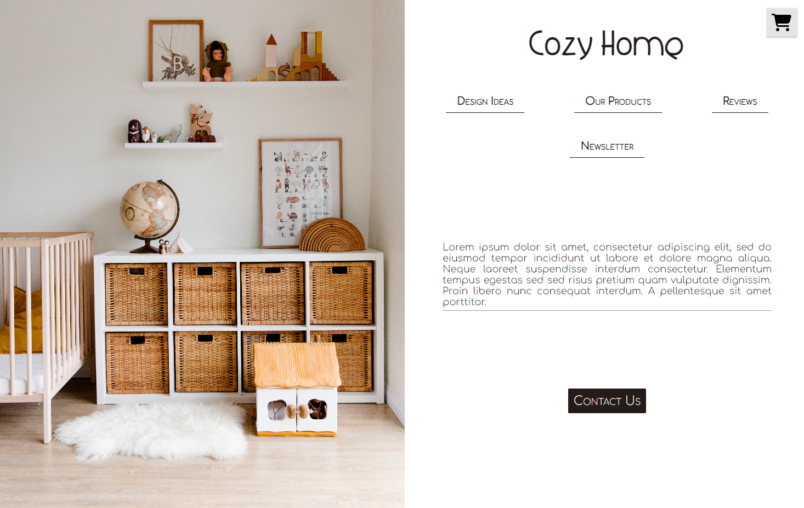
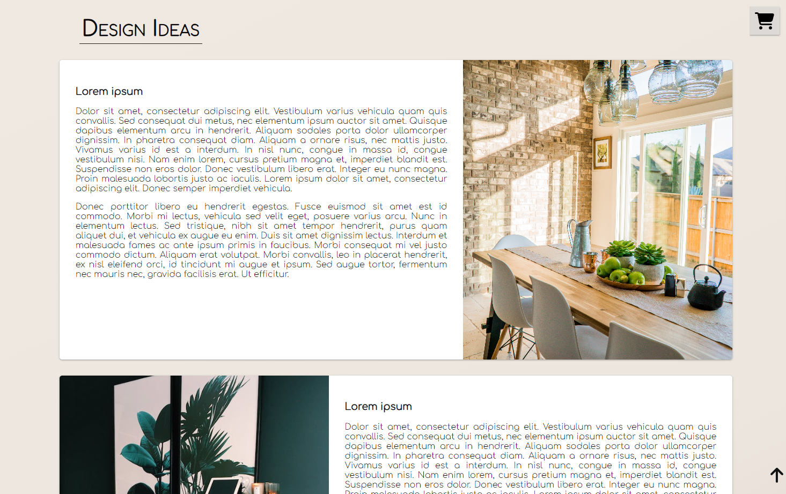
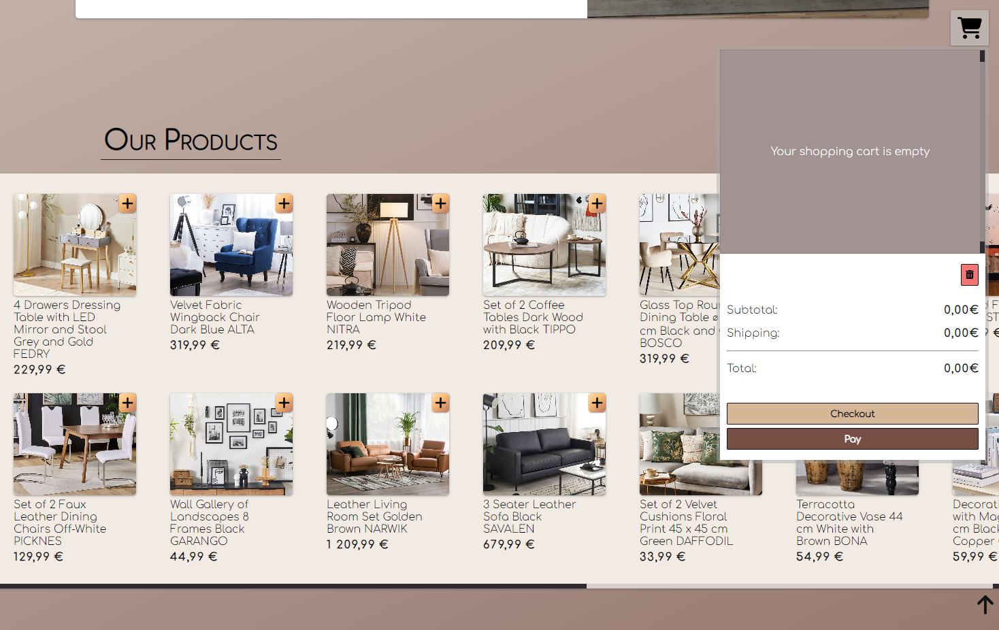

# Furniture Store Website

Welcome to the Furniture Store project repository! This repository contains the source code for a modern and elegant e-commerce website dedicated to showcasing and selling a wide range of furniture products.

## Table of Contents

- [About](#about)
- [Demo](#demo)
- [Features](#features)
- [Technologies Used](#technologies-used)
- [Installation](#installation)
- [Usage](#usage)
- [Contributing](#contributing)
- [License](#license)
- [Contact](#contact)

## About

The Furniture Store Website is designed to provide users with an enjoyable and convenient online shopping experience for furniture products. With a user-friendly interface and a vast collection of high-quality items, customers can explore, select, and purchase furniture items that suit their preferences and needs.

## Demo

Explore the live demo of the Furniture Store Website: [https://b-na.github.io/furniture_store/](https://b-na.github.io/furniture_store/)

## Features

- Browse through a wide variety of furniture products.
- Convenient shopping cart system for easy item selection and checkout.
- Responsive design for seamless browsing on various devices.

## Technologies Used

- HTML5
- CSS3
- SASS
- JavaScript
- React

## Installation

To set up this project locally, follow these steps:

1. Clone the repository: `git clone https://github.com/b-na/furniture_store.git`
2. Navigate to the project directory: `cd furniture_store`

## Usage

1. Open the `index.html` file in your preferred web browser.
2. Explore the various furniture categories, select products, and add them to your cart.
## Contributing

Contributions are welcome! If you'd like to contribute to this project, please follow these steps:

1. Fork the repository.
2. Create a new branch for your feature: `git checkout -b feature-new-feature`
3. Make your changes and commit them: `git commit -m "Add new feature"`
4. Push to your branch: `git push origin feature-new-feature`
5. Create a pull request explaining your changes.

## License

This project is licensed under the [MIT License](LICENSE).

## Contact

If you have any questions, suggestions, or would like to connect, you can reach out to me:

- Email: binawagner.contact@gmail.com
- GitHub: [@b-na](https://github.com/b-na)

Feel free to explore the Furniture Store Website and experience a virtual shopping journey!
